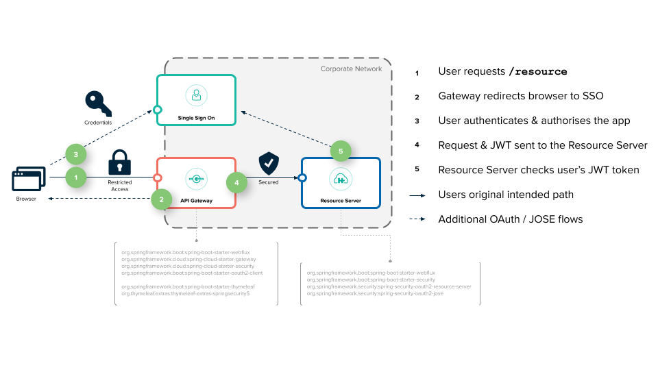

# Spring authorization server using OIDC implement

## About The Project

### About The Project

After [announcement about APIs related to Java has been deprecated ](https://www.keycloak.org/2022/02/adapter-deprecation)
of Keycloak. Spring released versions of Spring Cloud Authorization Server for authentication/authorization based on
Spring Security for providing the solution for the gap of deprecated APIs of Keycloak.

What is being deprecated:

- ~~OpenID Connect Java adapters~~
- ~~OpenID Connect Node.js adapters~~
- ~~SAML Tomcat and Jetty adapters~~

What is not being deprecated:

- OpenID Connect client-side JavaScript adapter
- SAML WildFly and servlet filter

**Notices**: Spring Cloud Authorization Server is new, so it has less of tutorial and fewer features mature enough.

### Build with:

- 
- 
- 
- 

## Getting Started

As I research about the design patterns for using authorization server, we can see 2 patterns mostly using in the field
as the images below:

**Spring gateway as the client server**


**Spring gateway as the resource server**


In this source we're using Spring Gateway as the resource server, because of reducing the heavy in configuration and
security logic in each service, we just need config and check in central place that means at the gateway.


Implemented pattern

**Look deeper**

The OAuth 2.0 specification describes a number of grants (“methods”) for a client application to acquire an access
token (which represents a user’s permission for the client to access their data).

Spring OAuth2 predefined grant types:

- ClientCredentialsTokenGranter
- RefreshTokenGranter
- AuthorizationCodeTokenGranter
- ImplicitTokenGranter
- ResourceOwnerPasswordTokenGranter(it`s password grant type which one you use in example)

If you want to change token acquiring logic you can go with custom TokenGranter.

To run quickly with docker-compose just need to run maven command:

**Here we go**

Run with docker-compose

```shell
mvn clean install
docker-compose build --no-cache
docker-compose up --force-recreate
```

Run with docker-compose with multiple stage

```shell
docker-compose build -f docker-compose-v1.yml --no-cache
docker-compose up -f docker-compose-v1.yml --force-recreate
```


