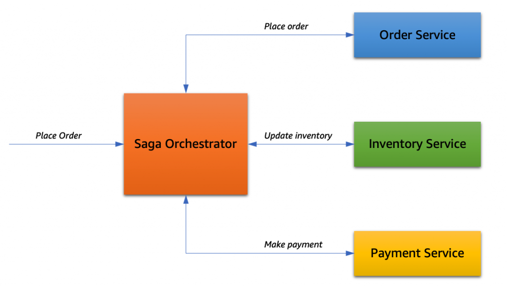

# Orchestration Saga document
## Getting started
Saga is well-known design pattern that is used to manage distributed transactions in a microservice
architecture. There are two common saga implementation approaches, choreography and orchestration

** Orchestration**

The Saga Orchestrator is responsible for managing the lifecycle of the Saga
In this part we're using main service as Saga Orchestrator

## Setup and Run
### 1. Environments
- Java 17
- Maven
- Docker
### 2. Build and Run

```
mvn clean install -DskipTests
mvn clean install
docker compose up

```
### 3. Test 
```
API /backoffice/api/v1/backoffice/order